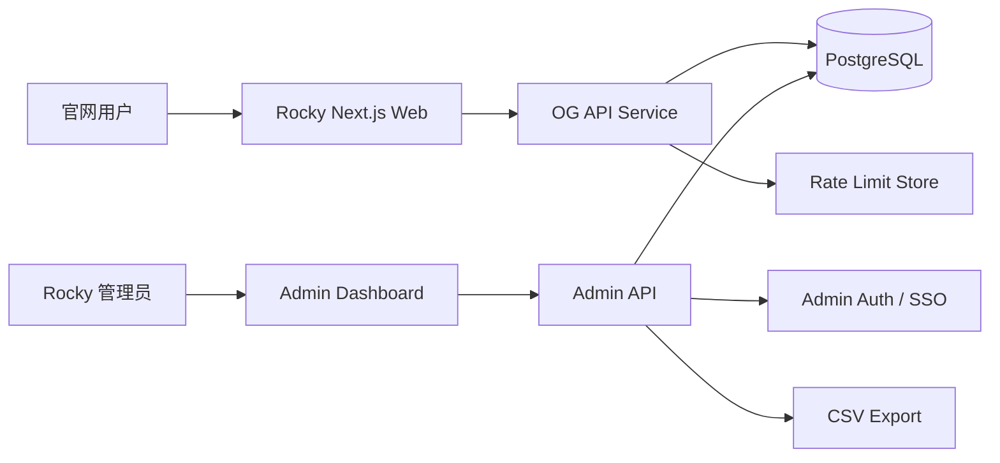
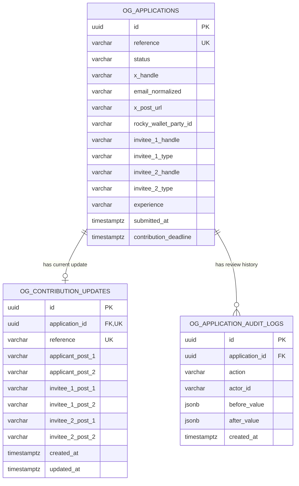
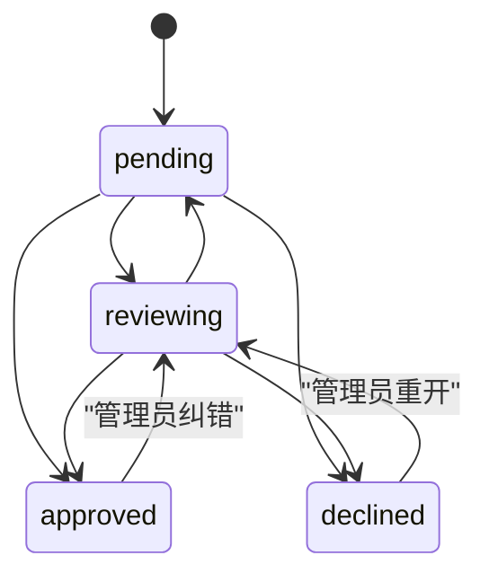

# Rocky OG Access 后端技术交接文档

> 文档状态：可进入后端评审与开发
> 对应前端：`office_web` 当前本地版本
> 技术基线：Next.js 15 / React 19
> 最后核对日期：2026-07-26
> 时区约定：服务端和数据库统一使用 UTC

## 1. 文档目的

本文档定义 Rocky 官网 OG Access 功能的正式后端实现要求，包括：

- OG 申请表的接收、校验和持久化；
- 申请提交后 96 小时内的贡献更新；
- 管理后台的数据查询、审核状态更新和 CSV 导出；
- 数据库表结构、接口协议、安全、部署、监控和迁移要求；
- 前后端联调与上线验收标准。

本文档以当前前端已经使用的接口和字段为兼容基线。后端可以继续部署在 Next.js Route Handler 内，也可以拆成独立服务，但公开接口路径和 JSON 响应必须保持兼容，除非前后端同步修改。

## 2. 当前功能范围

### 2.1 用户流程

1. 用户进入 `/og-access`。
2. 用户完成四步 OG 申请：
   - Identity：X Handle、Email；
   - Verification：公开 X 帖子链接、可选 Rocky Wallet Party ID；
   - Network：计划邀请的用户、项目、机构或社区；
   - Experience：Canton 或交易经历、信息使用同意；
3. 前端调用 `POST /api/og-applications`。
4. 后端返回公开申请编号，例如 `OG-APP-54D193AD`。
5. 用户进入审核队列，并获得从申请提交时间开始计算的 96 小时贡献窗口。
6. 用户可进入 `/og-access/update?applicationId=OG-APP-XXXXXXXX`，提交本人及拟邀请人的公开 X 内容链接。
7. 前端调用 `POST /api/og-contributions`。
8. 管理员在 `/admin/og-applications` 查看申请、贡献信息并导出 CSV。

### 2.2 业务原则

- 首批 OG 展示容量为 500，但“提交申请”不等于“占用 OG 名额”。
- 申请提交后默认状态为 `pending`。
- 贡献更新是可选加分项，不保证申请通过。
- 贡献更新窗口固定为申请服务端入库时间后的 96 小时。
- 用户本人至少提交 1 条公开 X 帖子才能提交贡献更新。
- 用户本人第 2 条帖子、Invitee #1 和 Invitee #2 的所有帖子均为选填。
- Invitee #1 的 X Handle 和类型在 OG 申请中必填；Invitee #2 整组选填。
- Rocky Wallet Party ID 选填，只允许用户填写公开 Party ID。不得采集助记词、私钥、密码或恢复短语。
- 后端必须以服务端校验为准，不能依赖前端校验保证数据合法性。

## 3. 当前实现与正式后端的差异

当前代码已具备可运行的接口原型，但存储层是本地 CSV：

| 功能 | 当前实现 | 正式环境要求 |
|---|---|---|
| OG 申请存储 | `data/og-applications.csv` | PostgreSQL 持久化 |
| 贡献更新存储 | `data/og-contribution-updates.csv` | PostgreSQL 持久化 |
| 并发写入 | 单 Node 进程内 Promise 队列 | 数据库事务和唯一约束 |
| 管理员鉴权 | URL 查询参数 `?key=` | SSO/管理员会话，或至少 Bearer Token |
| 防机器人 | Honeypot | Honeypot + 限流；必要时加 Turnstile |
| 审核状态更新 | 仅展示，无修改接口 | 管理员状态更新接口 |
| 部署方式 | 需要可写文件系统 | Node 服务 + PostgreSQL，不依赖实例本地文件 |
| 审计 | 无 | 审核操作审计日志 |

正式环境不能继续把 CSV 当作主数据库，原因包括：多实例写入丢失、容器/服务器发布后文件丢失、无法可靠事务处理、无法安全检索和审计。

### 3.1 后端第一阶段最小交付

后端可以按以下顺序开发，先保证前端无需修改即可接入：

1. 建立 `og_applications`、`og_contribution_updates` 两张核心表；
2. 保持现有两个 POST 路径和响应格式，替换 CSV 存储为数据库事务；
3. 实现 96 小时窗口、Contribution Upsert、服务端字段校验和限流；
4. 管理页先由 Next.js 服务端直接读数据库，并保留两份 CSV 导出；
5. 上线前替换 URL Query Token 鉴权，接入备份、日志和告警；
6. 第二阶段再增加独立 Admin API、审核状态编辑和完整审计日志。

若时间有限，公开提交接口、数据库持久化、管理员鉴权和备份属于 P0；独立 Admin API 和高级 X 内容验证不应阻塞第一阶段。

## 4. 推荐系统结构



推荐方案：

- 数据库：PostgreSQL 15 或以上；
- API：可暂时保留在当前 Next.js 应用中，减少联调成本；
- 数据访问：后端可选择 Prisma、Drizzle 或原生参数化 SQL；
- 限流：单实例可短期内存限流，正式环境建议 Redis、Upstash 或网关层限流；
- 管理员鉴权：优先公司 SSO；MVP 可使用服务端 Session；
- 时间：所有时间在数据库中使用 `timestamptz`，API 输出 ISO 8601 UTC。

## 5. 核心数据关系



核心业务只需要两张表：`og_applications` 和 `og_contribution_updates`。第三张 `og_application_audit_logs` 强烈建议用于生产审核留痕，但不阻塞第一版公开提交接口上线。

## 6. 数据库设计

### 6.1 PostgreSQL 扩展与枚举

```sql
CREATE EXTENSION IF NOT EXISTS pgcrypto;

CREATE TYPE og_application_status AS ENUM (
  'pending',
  'reviewing',
  'approved',
  'declined'
);

CREATE TYPE og_invitee_type AS ENUM (
  'Individual',
  'Project',
  'Institution',
  'Community',
  'Market Maker',
  'Other'
);
```

如果团队的迁移工具不便管理 PostgreSQL Enum，也可以使用 `varchar` + `CHECK` 约束，但 API 返回值仍应严格限制在上述集合中。

### 6.2 `og_applications`

```sql
CREATE TABLE og_applications (
  id uuid PRIMARY KEY DEFAULT gen_random_uuid(),
  reference varchar(15) NOT NULL UNIQUE,

  status og_application_status NOT NULL DEFAULT 'pending',

  x_handle varchar(16) NOT NULL,
  x_handle_normalized varchar(15) NOT NULL,
  email varchar(160) NOT NULL,
  email_normalized varchar(160) NOT NULL,
  x_post_url varchar(300) NOT NULL,
  rocky_wallet_party_id varchar(300),

  invitee_1_handle varchar(16) NOT NULL,
  invitee_1_handle_normalized varchar(15) NOT NULL,
  invitee_1_type og_invitee_type NOT NULL,
  invitee_2_handle varchar(16),
  invitee_2_handle_normalized varchar(15),
  invitee_2_type og_invitee_type,

  experience varchar(1200) NOT NULL,

  consent_version varchar(40) NOT NULL,
  consented_at timestamptz NOT NULL,
  source varchar(120) NOT NULL DEFAULT 'rocky-website',

  submitted_at timestamptz NOT NULL DEFAULT now(),
  contribution_deadline timestamptz NOT NULL,
  updated_at timestamptz NOT NULL DEFAULT now(),

  reviewed_at timestamptz,
  reviewed_by varchar(160),
  admin_notes text,

  request_id uuid,
  ip_hash char(64),
  user_agent_hash char(64),
  deleted_at timestamptz,

  CONSTRAINT og_application_reference_format
    CHECK (reference ~ '^OG-APP-[A-Z0-9]{8}$'),
  CONSTRAINT og_application_x_handle_format
    CHECK (x_handle ~ '^@[A-Za-z0-9_]{1,15}$'),
  CONSTRAINT og_application_invitee_1_format
    CHECK (invitee_1_handle ~ '^@[A-Za-z0-9_]{1,15}$'),
  CONSTRAINT og_application_invitee_2_complete
    CHECK (
      (invitee_2_handle IS NULL AND invitee_2_handle_normalized IS NULL AND invitee_2_type IS NULL)
      OR
      (invitee_2_handle IS NOT NULL AND invitee_2_handle_normalized IS NOT NULL AND invitee_2_type IS NOT NULL)
    ),
  CONSTRAINT og_application_deadline_after_submit
    CHECK (contribution_deadline = submitted_at + interval '96 hours')
);

CREATE INDEX idx_og_applications_status_submitted
  ON og_applications (status, submitted_at DESC)
  WHERE deleted_at IS NULL;

CREATE INDEX idx_og_applications_email
  ON og_applications (email_normalized)
  WHERE deleted_at IS NULL;

CREATE INDEX idx_og_applications_x_handle
  ON og_applications (x_handle_normalized)
  WHERE deleted_at IS NULL;

CREATE INDEX idx_og_applications_submitted
  ON og_applications (submitted_at DESC)
  WHERE deleted_at IS NULL;

CREATE UNIQUE INDEX idx_og_applications_request_id
  ON og_applications (request_id)
  WHERE request_id IS NOT NULL;
```

字段说明：

| 字段 | 说明 |
|---|---|
| `reference` | 对用户公开的申请编号，格式 `OG-APP-XXXXXXXX` |
| `id` | 仅后端内部使用的 UUID，不暴露给普通用户 |
| `x_handle` | 规范化后带 `@` 的展示值 |
| `*_normalized` | 去掉 `@` 并转小写，用于查询、限流和重复检测 |
| `email` | 规范化后的邮箱；当前前端和原型服务会转小写 |
| `rocky_wallet_party_id` | 可选公开 Rocky Wallet Party ID；数据库列避免继续使用过于宽泛的 `walletPartyId` 名称 |
| `contribution_deadline` | 必须由服务端基于 `submitted_at` 计算，不能接受客户端传入 |
| `request_id` | 可选幂等键，避免网络重试产生重复申请 |
| `ip_hash` | 可选风控字段，只保存加盐哈希，不保存原始 IP |
| `deleted_at` | 软删除/隐私删除流程使用，默认查询必须排除 |

关于重复申请：当前前端协议没有规定一个邮箱或 X Handle 只能申请一次，因此不要直接加唯一约束。产品确认规则后，可选择：

- 同一邮箱/X Handle 只保留一条有效申请；或
- 允许再次申请，但在管理端标记重复；或
- 相同内容在短时间内重试时返回原申请编号，其余情况创建新申请。

### 6.3 `og_contribution_updates`

```sql
CREATE TABLE og_contribution_updates (
  id uuid PRIMARY KEY DEFAULT gen_random_uuid(),
  application_id uuid NOT NULL UNIQUE
    REFERENCES og_applications(id) ON DELETE CASCADE,
  reference varchar(15) NOT NULL UNIQUE,

  applicant_post_1 varchar(300) NOT NULL,
  applicant_post_2 varchar(300),
  invitee_1_post_1 varchar(300),
  invitee_1_post_2 varchar(300),
  invitee_2_post_1 varchar(300),
  invitee_2_post_2 varchar(300),

  consent_version varchar(40) NOT NULL,
  consented_at timestamptz NOT NULL,
  source varchar(120) NOT NULL DEFAULT 'rocky-website',

  created_at timestamptz NOT NULL DEFAULT now(),
  updated_at timestamptz NOT NULL DEFAULT now(),
  request_id uuid,
  ip_hash char(64),

  CONSTRAINT og_contribution_reference_format
    CHECK (reference ~ '^OG-UPD-[A-Z0-9]{8}$')
);

CREATE INDEX idx_og_contributions_updated
  ON og_contribution_updates (updated_at DESC);

CREATE UNIQUE INDEX idx_og_contributions_request_id
  ON og_contribution_updates (request_id)
  WHERE request_id IS NOT NULL;
```

每份申请最多保留一条“当前贡献更新”。用户在 96 小时内再次提交时执行 Upsert：

- 保持原 `id` 和 `reference`；
- 覆盖六个帖子链接字段；
- 更新 `updated_at`、`consented_at` 和 `source`；
- 不改变原申请 `submitted_at` 和 `contribution_deadline`。

如果后续需要保留每次修改历史，可把每次写入前后的值写入审计表，而不是在核心表中生成多条当前记录。

### 6.4 `og_application_audit_logs`（推荐）

```sql
CREATE TABLE og_application_audit_logs (
  id uuid PRIMARY KEY DEFAULT gen_random_uuid(),
  application_id uuid
    REFERENCES og_applications(id) ON DELETE SET NULL,
  action varchar(60) NOT NULL,
  actor_id varchar(160) NOT NULL,
  before_value jsonb,
  after_value jsonb,
  created_at timestamptz NOT NULL DEFAULT now()
);

CREATE INDEX idx_og_audit_application_time
  ON og_application_audit_logs (application_id, created_at DESC);
```

至少记录：审核状态变化、管理员备注变化、数据导出、软删除和恢复操作。

导出等全局管理动作可以让 `application_id` 为空；与单份申请相关的状态或备注动作必须填写 `application_id`。使用 `ON DELETE SET NULL` 是为了在依法删除申请个人信息后仍保留不含个人内容的安全审计记录。

## 7. 公开 API 总则

### 7.1 基础约定

- Base URL：与官网同源时使用相对路径；独立服务时由环境变量配置。
- Content Type：`application/json; charset=utf-8`。
- JSON Body 上限：建议 16 KB。
- 时间字段：ISO 8601 UTC，例如 `2026-07-25T16:17:00.000Z`。
- 所有响应建议增加 `Cache-Control: no-store`。
- 所有响应建议增加 `X-Request-Id`，日志中使用同一 Request ID。
- 错误响应可增加稳定的 `code` 字段；当前前端会忽略未知字段，因此向后兼容。
- 不在错误信息中返回数据库、堆栈、SQL、文件路径或内部 UUID。

### 7.2 通用错误结构

```json
{
  "ok": false,
  "code": "VALIDATION_ERROR",
  "message": "Please review the highlighted fields.",
  "errors": {
    "email": "Enter a valid email address."
  },
  "requestId": "4bb720e4-9a35-4c9e-b601-1baef502a200"
}
```

`errors` 的 Key 必须使用前端字段名，前端会根据这些 Key 把错误显示在对应输入框下方。

## 8. 接口一：提交 OG 申请

### 8.1 请求

`POST /api/og-applications`

```json
{
  "xHandle": "@rocky_trader",
  "email": "trader@example.com",
  "xPostUrl": "https://x.com/rocky_trader/status/1234567890",
  "walletPartyId": "party::public-rocky-id",
  "plannedInvitee1Handle": "@invitee_one",
  "plannedInvitee1Type": "Individual",
  "plannedInvitee2Handle": "@project_two",
  "plannedInvitee2Type": "Project",
  "experience": "I follow the Canton ecosystem and trade spot and perpetual markets.",
  "consent": true,
  "website": "",
  "source": "rocky-website"
}
```

### 8.2 字段规则

| 字段 | 类型 | 必填 | 最大长度 | 服务端规则 |
|---|---:|---:|---:|---|
| `xHandle` | string | 是 | 输入清洗 50；有效值 15 个字符 | `@` 可有可无；主体匹配 `[A-Za-z0-9_]{1,15}`；入库统一补 `@` |
| `email` | string | 是 | 160 | 去首尾空格、转小写、校验邮箱格式 |
| `xPostUrl` | string | 是 | 300 | HTTPS；域名仅 `x.com` 或 `twitter.com`；必须是公开帖子直链 |
| `walletPartyId` | string | 否 | 300 | 去首尾空格；只接收公开 Rocky Wallet Party ID |
| `plannedInvitee1Handle` | string | 是 | 输入清洗 50；有效值 15 个字符 | X Handle 规则同申请人 |
| `plannedInvitee1Type` | enum | 是 | 40 | 仅允许前述六种类型 |
| `plannedInvitee2Handle` | string | 否 | 输入清洗 50；有效值 15 个字符 | 与 `plannedInvitee2Type` 必须同时为空或同时有值 |
| `plannedInvitee2Type` | enum | 条件必填 | 40 | 有 Invitee #2 Handle 时必填 |
| `experience` | string | 是 | 1200 | 合并连续空白并去首尾空格；不能是空字符串 |
| `consent` | boolean | 是 | — | 必须严格等于 `true` |
| `website` | string | 否 | 200 | Honeypot；只要非空就拒绝请求 |
| `source` | string | 否 | 120 | 默认 `rocky-website`；当前前端使用 `utm_source` 覆盖 |

字符串清洗需要和当前原型保持一致：连续空白折叠为一个空格、去首尾空格、再按最大长度截断。邮箱在清洗后转小写。

推荐将 X 帖子校验收紧为：

```text
https://x.com/{handle}/status/{numeric_id}
https://twitter.com/{handle}/status/{numeric_id}
```

不要只根据 URL 字符串判断内容真实性。是否需要调用 X API 检查帖子公开状态、作者和发布时间属于后续增强项；第一版可以只做格式校验并由审核人员打开检查。

### 8.3 成功响应

HTTP `200 OK`（保持当前前端兼容）：

```json
{
  "ok": true,
  "applicationId": "OG-APP-54D193AD",
  "submittedAt": "2026-07-25T16:17:00.000Z"
}
```

`applicationId` 是公开编号，不是数据库 UUID。`submittedAt` 必须是数据库/服务端生成的权威时间，前端使用它展示 96 小时截止时间。

### 8.4 错误响应

| HTTP | `code` | 场景 |
|---:|---|---|
| 400 | `INVALID_JSON` | Body 不是合法 JSON |
| 400 | `VALIDATION_ERROR` | 字段不合法或 Honeypot 非空 |
| 409 | `DUPLICATE_APPLICATION` | 仅在产品确认禁止重复申请后启用 |
| 413 | `PAYLOAD_TOO_LARGE` | 请求超过 Body 上限 |
| 429 | `RATE_LIMITED` | 请求超过限流策略 |
| 500 | `INTERNAL_ERROR` | 持久化或未知服务端错误 |
| 503 | `SERVICE_UNAVAILABLE` | 数据库暂时不可用 |

当前前端兼容的 400 响应示例：

```json
{
  "ok": false,
  "message": "Please review the highlighted fields.",
  "errors": {
    "plannedInvitee1Handle": "Enter a valid X handle for Invitee #1."
  }
}
```

### 8.5 服务端事务

一次申请提交应在一个事务中完成：

1. 校验和规范化输入；
2. 生成不冲突的 `OG-APP-XXXXXXXX`；
3. 生成 `submitted_at = now()`；
4. 生成 `contribution_deadline = submitted_at + 96 hours`；
5. 写入申请记录；
6. 提交事务后返回公开编号和提交时间。

公开编号建议从加密安全随机源生成 8 位大写十六进制或大写字母数字。数据库唯一冲突时重新生成，最多重试 3 次。

## 9. 接口二：提交或覆盖贡献更新

### 9.1 请求

`POST /api/og-contributions`

```json
{
  "applicationId": "OG-APP-54D193AD",
  "email": "trader@example.com",
  "applicantPost1": "https://x.com/rocky_trader/status/1234567891",
  "applicantPost2": "https://x.com/rocky_trader/status/1234567892",
  "invitee1Post1": "https://x.com/invitee_one/status/1234567893",
  "invitee1Post2": "",
  "invitee2Post1": "",
  "invitee2Post2": "",
  "consent": true,
  "website": "",
  "source": "rocky-website"
}
```

### 9.2 字段规则

| 字段 | 类型 | 必填 | 最大长度 | 服务端规则 |
|---|---:|---:|---:|---|
| `applicationId` | string | 是 | 40 | 转大写后匹配 `^OG-APP-[A-Z0-9]{8}$` |
| `email` | string | 是 | 160 | 规范化后必须与原申请邮箱完全匹配 |
| `applicantPost1` | string | 是 | 300 | 公开 X 帖子直链 |
| `applicantPost2` | string | 否 | 300 | 非空时校验公开 X 帖子直链 |
| `invitee1Post1` | string | 否 | 300 | 非空时校验公开 X 帖子直链 |
| `invitee1Post2` | string | 否 | 300 | 非空时校验公开 X 帖子直链 |
| `invitee2Post1` | string | 否 | 300 | 非空时校验公开 X 帖子直链 |
| `invitee2Post2` | string | 否 | 300 | 非空时校验公开 X 帖子直链 |
| `consent` | boolean | 是 | — | 必须严格等于 `true` |
| `website` | string | 否 | 200 | Honeypot；非空即拒绝 |
| `source` | string | 否 | 120 | 默认 `rocky-website` |

重要：`invitee1Post1` 是选填。不要把 Invitee #1 的第一条帖子误设成必填。

### 9.3 申请匹配与窗口判断

后端必须同时匹配：

- `applicationId` = `og_applications.reference`；
- `lower(email)` = `og_applications.email_normalized`；
- `deleted_at IS NULL`。

窗口判断：

```text
now() <= contribution_deadline
```

截止时刻相等时允许提交，超过截止时刻才返回已关闭。时间必须使用数据库或服务端 UTC，不能信任客户端时间。

为了减少枚举申请编号或邮箱的风险，编号不存在和邮箱不匹配对外使用相同消息。日志可以记录内部原因，但不能在响应中泄露“编号存在但邮箱错误”。

### 9.4 Upsert 语义

一份申请只保留一个当前 Contribution Update：

```sql
INSERT INTO og_contribution_updates (...)
VALUES (...)
ON CONFLICT (application_id)
DO UPDATE SET
  applicant_post_1 = EXCLUDED.applicant_post_1,
  applicant_post_2 = EXCLUDED.applicant_post_2,
  invitee_1_post_1 = EXCLUDED.invitee_1_post_1,
  invitee_1_post_2 = EXCLUDED.invitee_1_post_2,
  invitee_2_post_1 = EXCLUDED.invitee_2_post_1,
  invitee_2_post_2 = EXCLUDED.invitee_2_post_2,
  consent_version = EXCLUDED.consent_version,
  consented_at = EXCLUDED.consented_at,
  source = EXCLUDED.source,
  updated_at = now();
```

Upsert 必须在事务内再次锁定并读取申请记录，防止窗口判断和写入之间出现边界竞态。推荐使用 `SELECT ... FOR UPDATE`。

### 9.5 成功响应

HTTP `200 OK`：

```json
{
  "ok": true,
  "updateId": "OG-UPD-1A2B3C4D",
  "submittedAt": "2026-07-26T09:30:00.000Z"
}
```

同一申请再次提交时，`updateId` 保持不变；`submittedAt` 返回本次成功覆盖的服务端时间。

### 9.6 错误响应

| HTTP | `code` | 场景 |
|---:|---|---|
| 400 | `INVALID_JSON` | Body 不是合法 JSON |
| 400 | `VALIDATION_ERROR` | 字段或帖子 URL 不合法 |
| 404 | `APPLICATION_NOT_FOUND` | 申请编号与邮箱无法匹配 |
| 410 | `CONTRIBUTION_WINDOW_CLOSED` | 已超过申请提交后的 96 小时 |
| 413 | `PAYLOAD_TOO_LARGE` | 请求超过 Body 上限 |
| 429 | `RATE_LIMITED` | 请求超过限流策略 |
| 500 | `INTERNAL_ERROR` | 数据库或未知错误 |

404 兼容示例：

```json
{
  "ok": false,
  "message": "Application reference and email do not match.",
  "errors": {
    "applicationId": "Check your application reference and email."
  }
}
```

410 兼容示例：

```json
{
  "ok": false,
  "message": "The 96-hour contribution window has closed."
}
```

## 10. 管理后台接口

当前管理页是 Next.js 服务端组件直接读取存储层。如果后端独立部署，或需要多个管理端消费者，应提供以下 Admin API。

### 10.1 列表查询

`GET /api/admin/og-applications`

查询参数：

| 参数 | 默认 | 说明 |
|---|---|---|
| `page` | `1` | 从 1 开始 |
| `pageSize` | `50` | 最大 100 |
| `status` | 全部 | `pending/reviewing/approved/declined` |
| `hasContribution` | 全部 | `true/false` |
| `window` | 全部 | `open/closed` |
| `q` | 空 | 精确或前缀查 Reference、邮箱、X Handle |
| `sort` | `submittedAt` | 允许白名单字段 |
| `order` | `desc` | `asc/desc` |

成功响应：

```json
{
  "ok": true,
  "items": [
    {
      "applicationId": "OG-APP-54D193AD",
      "status": "pending",
      "xHandle": "@rocky_trader",
      "email": "trader@example.com",
      "xPostUrl": "https://x.com/rocky_trader/status/1234567890",
      "walletPartyId": "party::public-rocky-id",
      "plannedInvitee1Handle": "@invitee_one",
      "plannedInvitee1Type": "Individual",
      "plannedInvitee2Handle": "@project_two",
      "plannedInvitee2Type": "Project",
      "experience": "...",
      "submittedAt": "2026-07-25T16:17:00.000Z",
      "contributionDeadline": "2026-07-29T16:17:00.000Z",
      "contributionWindowOpen": true,
      "contribution": {
        "updateId": "OG-UPD-1A2B3C4D",
        "applicantPost1": "https://x.com/rocky_trader/status/1234567891",
        "applicantPost2": "",
        "invitee1Post1": "",
        "invitee1Post2": "",
        "invitee2Post1": "",
        "invitee2Post2": "",
        "updatedAt": "2026-07-26T09:30:00.000Z"
      }
    }
  ],
  "pagination": {
    "page": 1,
    "pageSize": 50,
    "total": 123,
    "totalPages": 3
  },
  "stats": {
    "total": 123,
    "pending": 100,
    "reviewing": 15,
    "approved": 5,
    "declined": 3,
    "withContribution": 42
  }
}
```

### 10.2 查看单条申请

`GET /api/admin/og-applications/{applicationId}`

返回完整申请、当前贡献更新和审核操作历史。普通列表可隐藏或截断管理员备注，详情接口再完整返回。

### 10.3 更新审核状态

`PATCH /api/admin/og-applications/{applicationId}`

```json
{
  "status": "reviewing",
  "adminNotes": "Strong Canton background; contribution links verified.",
  "expectedUpdatedAt": "2026-07-26T09:00:00.000Z"
}
```

规则：

- `status` 必须属于四个状态；
- `adminNotes` 最大建议 5000 字符；
- `expectedUpdatedAt` 用于乐观锁，避免两个审核人互相覆盖；
- 状态或备注变化必须写审计日志；
- `approved` 和 `declined` 时写入 `reviewed_at`、`reviewed_by`；
- 状态改变不自动向用户发邮件，除非产品另行确认通知流程。

### 10.4 状态流转



允许管理员纠错，但所有逆向流转必须保留审计记录。

## 11. CSV 导出

为兼容当前管理页，保留：

- `GET /api/og-applications/export`
- `GET /api/og-contributions/export`

生产环境要求：

- 必须管理员鉴权；
- 不再把永久 Token 放入 URL 查询参数；
- 响应设置 `Cache-Control: no-store`；
- 响应设置 `Content-Disposition: attachment`；
- 使用 UTF-8；如运营使用 Windows Excel，可在确认后增加 UTF-8 BOM；
- 所有导出动作写审计日志，记录操作者、时间、筛选条件和导出记录数；
- 大数据量使用流式输出，避免一次性加载全部数据；当前预计规模较小，但实现不应依赖本地文件。

Applications CSV 列顺序保持当前格式：

```text
id,submittedAt,status,xHandle,email,xPostUrl,walletPartyId,plannedInvitee1Handle,plannedInvitee1Type,plannedInvitee2Handle,plannedInvitee2Type,experience,consent,source
```

Contribution Updates CSV 列顺序保持当前格式：

```text
id,submittedAt,applicationId,email,applicantPost1,applicantPost2,invitee1Post1,invitee1Post2,invitee2Post1,invitee2Post2,consent,source
```

注意：数据库内部 UUID 不应导出到当前兼容 CSV。上述 `id` 指公开 `OG-APP-*` 或 `OG-UPD-*` 编号。Contribution CSV 中的 `email` 可通过关联申请实时取得，不需要在贡献表重复存储。

## 12. 管理员鉴权与权限

### 12.1 当前临时机制

当前代码使用：

```text
/admin/og-applications?key={OG_ADMIN_TOKEN}
```

这种方式只适合本地或临时测试。URL 会进入浏览器历史、服务器日志、代理日志和分析系统，不应作为正式管理员鉴权。

### 12.2 生产推荐

优先级从高到低：

1. 公司身份系统/SSO + 服务端 Session；
2. Cloudflare Access、AWS ALB OIDC 等入口层鉴权；
3. 短期 MVP 使用 `Authorization: Bearer <token>`，Token 只存在服务端安全配置中，并支持轮换。

最少需要两个角色：

| 角色 | 权限 |
|---|---|
| `og_reviewer` | 查看申请、更新状态和备注 |
| `og_admin` | Reviewer 权限 + CSV 导出 + 删除/恢复 + 权限管理 |

所有 Admin API 默认拒绝匿名请求。未授权返回 `401`，无权限返回 `403`，不要用前端隐藏按钮代替服务端授权。

## 13. 安全与滥用防护

### 13.1 公开接口

- 只接受 `POST` 和 JSON Content Type；
- 限制 Body 大小；
- 服务端再次校验所有字段；
- 数据库查询必须参数化；
- Honeypot `website` 非空时拒绝；
- 同源部署时限制允许的 Origin；跨域部署时只允许官网生产域名和明确的预发布域名；
- 建议申请接口每 IP 每 15 分钟最多 5 次，每天最多 20 次；
- 建议贡献接口每 IP 每小时最多 10 次；
- 429 响应返回 `Retry-After`；
- 触发明显机器人行为时可以统一返回通用错误，不泄露风控规则；
- 若垃圾申请仍明显，再引入 Cloudflare Turnstile，不要第一版就增加用户摩擦。

### 13.2 数据保护

- Email 属于个人信息，不写入普通访问日志；
- 原始 IP 不落库，只在确有风控需要时保存加盐哈希；
- Rocky Wallet Party ID 虽然是公开标识，也不应出现在错误日志和非授权监控事件中；
- 管理后台响应设置 `Cache-Control: no-store`；
- 管理页必须 `robots: noindex, nofollow`，并在入口层禁止公开访问；
- 数据库使用传输加密，备份加密；
- 生产、预发布和本地数据库完全隔离；
- 测试数据不得使用真实用户 Email、Party ID 或私密信息。

### 13.3 前端展示安全

- `experience`、Handle、Party ID 和管理员备注均按纯文本展示；
- 不允许把用户输入作为 HTML 注入；
- 外链只允许 `https://x.com` 和 `https://twitter.com`，打开新窗口时使用 `rel="noreferrer noopener"`；
- CSV 导出必须防止公式注入：若单元格以 `=`, `+`, `-`, `@`, Tab 或 CR 开头，导出时在最前面添加单引号 `'`，再做标准 CSV 转义。

### 13.4 Party ID 特别要求

- 字段只用于公开 Rocky Wallet Party ID；
- 不得增加其他项目方钱包名称或地址字段；
- 页面和接口都不收集助记词、私钥、密码、恢复短语；
- 客服和管理员发现用户误填疑似秘密信息时，应立即限制访问并按安全流程删除，不在普通工单中复制传播。

## 14. 幂等、并发和一致性

### 14.1 OG 申请

当前前端提交时会禁用按钮，但网络重试仍可能造成重复记录。后端建议支持可选请求头：

```text
Idempotency-Key: <UUID>
```

第一阶段可以让前端不传该 Header，保持零改动上线；后续前端加上后，后端对相同 Key 返回首次成功结果。幂等记录建议保留至少 24 小时。

### 14.2 贡献更新

- 通过 `UNIQUE(application_id)` 保证每个申请只有一条当前记录；
- 使用事务和 Upsert，禁止“先查再无锁写入”；
- 在事务中重新检查 96 小时窗口；
- 并发提交时以最后一个成功事务为当前值，审计表保留修改历史。

### 14.3 时间边界

- 所有业务时间由服务端或数据库生成；
- 判定窗口时不使用浏览器时间；
- 夏令时和用户时区只影响前端展示，不影响后端计算；
- 管理端展示可以转换时区，但 API 原值必须为 UTC。

## 15. 日志、监控和告警

### 15.1 结构化日志字段

每个请求至少记录：

```text
timestamp, level, service, environment, requestId, route,
method, httpStatus, latencyMs, errorCode
```

可记录经过哈希的申请 Reference 用于关联，但不要记录完整请求 Body、Email、Party ID、Experience 或帖子内容。

### 15.2 指标

- `og_application_submit_total{result}`；
- `og_contribution_submit_total{result}`；
- `og_api_request_duration_ms{route}`；
- `og_db_query_duration_ms{operation}`；
- `og_rate_limit_total{route}`；
- `og_admin_export_total{type}`；
- 待审核、审核中、通过、拒绝数量；
- 具有贡献更新的申请比例。

### 15.3 建议告警

- 公开提交接口 5xx 比例 5 分钟内超过 2%；
- 数据库连接失败或连接池耗尽；
- 写入延迟 P95 超过 1 秒；
- CSV 导出失败；
- 短时间内异常大量申请；
- 审计日志写入失败。

审计日志写入失败时，管理员写操作应整体失败，避免出现“状态已改但无审计记录”。

## 16. 数据保留、备份和删除

需要产品/法务最终确认保留周期。技术建议默认：

- 未通过申请：活动结束后保留 180 天，再删除或匿名化；
- 通过申请：按 OG 运营所需周期保留，目的结束后清理；
- 审计日志：至少 1 年；
- 数据库每日自动备份，至少保留 30 天；
- 上线前完成一次恢复演练；
- 用户删除请求按 Email 和申请 Reference 定位，经身份确认后执行软删除，再按计划从主库和备份中过期清理。

删除/匿名化后不应继续在管理后台列表和 CSV 导出中出现该用户的个人信息。

## 17. 环境变量

建议正式环境配置：

```dotenv
DATABASE_URL=postgresql://...
OG_ADMIN_AUTH_MODE=sso
OG_ADMIN_TOKEN=
OG_CONSENT_VERSION=og-application-v1
OG_CONTRIBUTION_CONSENT_VERSION=og-contribution-v1
OG_CONTRIBUTION_WINDOW_HOURS=96
OG_ALLOWED_ORIGINS=https://rocky.exchange
OG_IP_HASH_SALT=...
OG_RATE_LIMIT_ENABLED=true
```

说明：

- `OG_ADMIN_TOKEN` 仅兼容临时 MVP，使用 SSO 时留空；
- 窗口环境变量可以配置，但生产值必须固定为 96，修改需产品确认并记录；
- Secret 只进入 Secret Manager 或 CI/CD Secret，不提交 Git；
- 当前原型中的 `OG_APPLICATIONS_CSV_PATH` 和 `OG_CONTRIBUTIONS_CSV_PATH` 仅用于迁移期，不属于正式数据库方案。

## 18. CSV 到 PostgreSQL 迁移

当前本地原型可能已有两份数据：

- `data/og-applications.csv`
- `data/og-contribution-updates.csv`

它们已被 `.gitignore` 排除，不会随代码推送。上线前如果需要保留数据，必须单独安全备份和导入。

### 18.1 Applications 字段映射

| CSV | PostgreSQL |
|---|---|
| `id` | `reference` |
| `submittedAt` | `submitted_at` |
| `status` | `status` |
| `xHandle` | `x_handle` + 生成 `x_handle_normalized` |
| `email` | `email` + `email_normalized` |
| `xPostUrl` | `x_post_url` |
| `walletPartyId` | `rocky_wallet_party_id` |
| `plannedInvitee1Handle` | `invitee_1_handle` |
| `plannedInvitee1Type` | `invitee_1_type` |
| `plannedInvitee2Handle` | `invitee_2_handle` |
| `plannedInvitee2Type` | `invitee_2_type` |
| `experience` | `experience` |
| `consent` | 映射为 `consent_version` 和 `consented_at` |
| `source` | `source` |

`contribution_deadline = submitted_at + interval '96 hours'`。

### 18.2 Contributions 字段映射

| CSV | PostgreSQL |
|---|---|
| `id` | `reference` |
| `applicationId` | 先用申请 `reference` 查出内部 `application_id` |
| `submittedAt` | 首次导入同时作为 `created_at` 和 `updated_at` |
| `applicantPost1` | `applicant_post_1` |
| `applicantPost2` | `applicant_post_2` |
| `invitee1Post1` | `invitee_1_post_1` |
| `invitee1Post2` | `invitee_1_post_2` |
| `invitee2Post1` | `invitee_2_post_1` |
| `invitee2Post2` | `invitee_2_post_2` |
| `consent` | `consent_version` 和 `consented_at` |
| `source` | `source` |

CSV 中贡献记录的 `email` 只用于迁移校验：它应与关联申请邮箱一致，不需要重复入贡献表。

### 18.3 迁移步骤

1. 停止公开表单写入或进入短暂维护窗口；
2. 备份两份 CSV 并计算 SHA-256；
3. 在事务中导入 Applications；
4. 校验 Reference 唯一性、状态枚举、时间和必填字段；
5. 按 Application Reference 导入 Contributions；
6. 对比 CSV 行数、数据库行数和孤立 Contribution 数；
7. 随机抽查至少 10 条记录；
8. 切换 API 到 PostgreSQL；
9. 执行端到端提交与后台导出测试；
10. 保留只读加密备份，按既定保留周期销毁。

遇到旧版 Legacy 记录缺少新字段时，不要伪造用户数据。应允许数据库迁移脚本以受控的 `legacy` 标记导入，或由运营确认丢弃。当前管理页已经对缺失 X Post/Invitee 的旧数据提供 Legacy 展示。

## 19. 部署要求

### 19.1 当前仓库特性

- Next.js 配置已不再使用静态导出；
- API Route 和动态 Admin 页面要求持续运行 Node 服务；
- GitHub Actions 在 `main` 更新时通过 SSH 执行服务器上的 `bash ~/office.sh`；
- 实际 `office.sh` 不在仓库中，后端/运维必须确认它执行的是服务器应用构建和进程重启，而不是只复制静态文件。

### 19.2 推荐发布步骤

1. 安装锁文件依赖；
2. 执行数据库 Migration；
3. 执行单元测试、Lint、TypeScript 检查和 Production Build；
4. 以新版本启动一个健康实例；
5. 健康检查通过后切换流量；
6. 保留上一版本用于快速回滚；
7. Migration 必须向后兼容，禁止发布时直接删除旧字段；
8. 发布完成后执行公开提交、贡献更新、管理员查询和导出 Smoke Test。

推荐健康检查：

`GET /api/health`

```json
{
  "ok": true,
  "service": "rocky-office-web",
  "database": "up",
  "version": "<git-sha>"
}
```

健康检查不应返回 Secret、连接串、数据库版本细节或用户统计。

## 20. 前后端联调检查表

### 20.1 OG 申请

- [ ] 正常请求返回 `ok`, `applicationId`, `submittedAt`；
- [ ] `applicationId` 符合 `OG-APP-XXXXXXXX`；
- [ ] Email 入库为小写；
- [ ] X Handle 入库统一带 `@`；
- [ ] Invitee #1 Handle 和 Type 必填；
- [ ] Invitee #2 两字段必须同时为空或同时有值；
- [ ] `experience` 必填且最多 1200 字符；
- [ ] `walletPartyId` 为空时可提交；
- [ ] 非 X/Twitter HTTPS 帖子链接被拒绝；
- [ ] `website` Honeypot 非空时被拒绝；
- [ ] 错误 Key 与前端字段名完全一致；
- [ ] 连续快速点击或网络重试不会无控制地产生重复写入；
- [ ] 数据库异常时返回通用错误且不泄露内部信息。

### 20.2 贡献更新

- [ ] Application Reference 自动转大写后仍可匹配；
- [ ] Email 大小写不同但规范化后可匹配；
- [ ] 编号不存在和 Email 不匹配返回相同对外信息；
- [ ] `applicantPost1` 必填；
- [ ] `applicantPost2` 选填；
- [ ] 所有 Invitee Post 字段选填；
- [ ] 选填 URL 非空时仍严格校验；
- [ ] 96 小时内可提交；
- [ ] 等于截止时刻时可提交；
- [ ] 超过截止时刻返回 HTTP 410；
- [ ] 再次提交保持同一 `updateId` 并覆盖当前值；
- [ ] 同一申请并发提交不会生成两条当前记录。

### 20.3 管理后台

- [ ] 未登录无法访问页面、列表、详情、状态更新和导出；
- [ ] Reviewer 无法执行 Admin 专属操作；
- [ ] 列表默认按提交时间倒序；
- [ ] 统计数字与筛选和数据库一致；
- [ ] Contribution 正确关联到 Application；
- [ ] 状态更新使用乐观锁；
- [ ] 所有管理员写操作有审计日志；
- [ ] CSV 能被常用表格工具打开且不存在公式注入；
- [ ] 管理页和导出响应均不缓存。

## 21. 必须完成的自动化测试

### 单元测试

- 每个字段的正常、空值、边界长度和非法格式；
- X Handle 的 `@` 规范化；
- Email 小写和空白清洗；
- X/Twitter URL 白名单；
- Invitee #2 成对约束；
- Honeypot；
- 公开编号生成与冲突重试；
- 96 小时边界；
- 状态流转规则。

### 数据库集成测试

- Application 事务写入；
- Contribution 外键关联；
- Contribution Upsert；
- 唯一约束和并发写入；
- 管理员状态修改与审计同事务；
- Migration Up/Down 或向前修复路径。

### API 集成测试

- 本文档列出的全部 HTTP 状态；
- 响应 JSON 兼容当前前端；
- 速率限制与 `Retry-After`；
- 管理员鉴权和角色权限；
- CSV Header、顺序、转义与公式注入防护。

### 端到端测试

1. 官网完整提交 OG 申请；
2. 成功页显示申请编号和正确的 96 小时截止时间；
3. 点击 Contribution Update，Application Reference 自动带入；
4. 提交一条 Applicant Post，其他帖子留空；
5. 管理页看到 Application 与 Contribution 的关联；
6. 管理员将状态从 `pending` 改为 `reviewing`；
7. 导出两份 CSV 并核对记录。

## 22. 上线前阻塞项

以下项目完成前不建议开放正式流量：

1. PostgreSQL Schema 和 Migration 已落地；
2. 两个公开 POST 接口已改为数据库事务存储；
3. 生产管理员鉴权已替换 URL Query Token；
4. 公开接口完成服务端校验、Body 限制和限流；
5. 数据库备份、恢复和监控可用；
6. `office.sh` 已确认运行动态 Next.js 服务并正确注入 Secret；
7. 完成从提交到后台查询/导出的端到端验收；
8. 隐私文本、数据保留周期和重复申请规则由产品/法务确认。

## 23. 后端交付物清单

后端完成开发时应提交：

- 数据库 Migration；
- 数据模型和 Repository/DAO；
- `POST /api/og-applications`；
- `POST /api/og-contributions`；
- Admin 查询、详情、状态更新接口；
- Applications 和 Contributions CSV 导出；
- 管理员鉴权与角色校验；
- 限流和结构化日志；
- 单元、数据库集成、API 集成测试；
- 部署与回滚说明；
- 环境变量模板，但不得包含真实 Secret；
- CSV 历史数据迁移脚本和迁移核对报告。

## 24. 当前代码定位

后端开发联调时可参考：

| 位置 | 作用 |
|---|---|
| `src/lib/og-application-schema.ts` | OG 申请字段类型和原型校验 |
| `src/lib/og-application-store.ts` | 当前 CSV Application 存储，正式版需要替换 |
| `src/app/api/og-applications/route.ts` | 当前 OG 申请接口 |
| `src/lib/og-contribution-schema.ts` | Contribution 字段类型和原型校验 |
| `src/lib/og-contribution-store.ts` | 当前 CSV Contribution 存储，正式版需要替换 |
| `src/app/api/og-contributions/route.ts` | 当前 Contribution 接口和 96 小时判断 |
| `src/app/admin/og-applications/page.tsx` | 当前管理页数据需求 |
| `src/components/og-access/og-application-form.tsx` | 前端申请 Payload 和错误字段绑定 |
| `src/components/og-access/og-contribution-form.tsx` | 前端贡献更新 Payload 和错误字段绑定 |
| `src/__tests__/lib/og-application-schema.test.ts` | 申请校验测试基线 |
| `src/__tests__/lib/og-contribution-schema.test.ts` | 贡献校验测试基线 |

## 25. 需要产品确认但不阻塞接口开发的问题

1. 同一 Email 或 X Handle 是否允许多次申请；
2. 申请批准/拒绝后是否自动发送邮件；
3. 是否需要验证 X 帖子确实由申请人或对应 Invitee 发布；
4. 是否需要把审核评分拆成独立字段；
5. 未通过申请和审计日志的最终保留周期；
6. 活动结束后是否继续允许 Contribution Update；
7. 是否对管理员开放批量状态更新。

在这些规则确认前，后端应保持当前协议：允许提交、状态默认 `pending`、贡献窗口 96 小时、贡献更新只保存当前一份、不自动发送通知。
